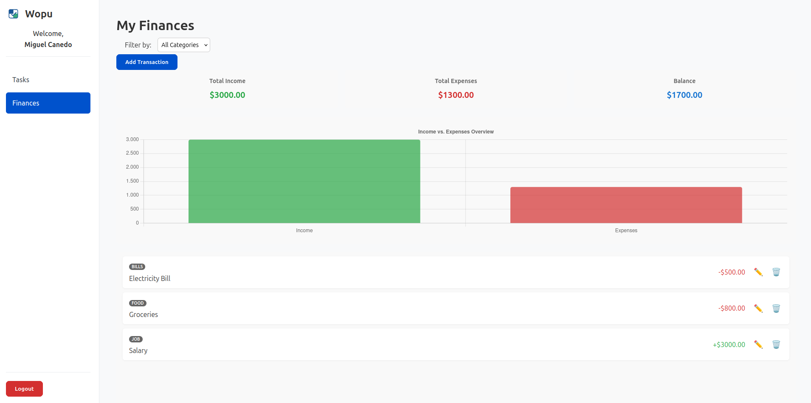

# Wopu 🚀



Wopu is a modern web platform designed for personal and financial growth. It integrates task management using the Eisenhower Matrix with a comprehensive personal finance tracker, helping users prioritize their lives and take control of their finances in one intuitive application.

---

## ✨ Key Features

*   **User Authentication:** Secure registration and login system using JWT for session management.
*   **Task Management (Eisenhower Matrix):** Create, edit, delete, and manage tasks classified into four priority quadrants:
    *   Important & Urgent
    *   Important & Not Urgent
    *   Not Important & Urgent
    *   Not Important & Not Urgent
*   **Personal Finance Tracker:** Log income and expenses, assign categories, and view a summary of your financial health.
*   **Visual Dashboards:** Interactive charts to visualize income vs. expenses.
*   **Role-Based Access Control:** A protected admin dashboard to view and manage all registered users.
*   **Onboarding Tour:** A guided tour for new users to quickly learn the main features of the platform.

## 🛠️ Tech Stack

*   **Frontend:**
    *   HTML5, CSS3, Vanilla JavaScript (ES Modules)
    *   [Chart.js](https://www.chartjs.org/) for financial charts.
    *   [Shepherd.js](https://shepherdjs.dev/) for the onboarding tour.

*   **Backend:**
    *   [Node.js](https://nodejs.org/)
    *   [Express.js](https://expressjs.com/) for the REST API.
    *   [MySQL2](https://github.com/sidorares/mysql2) for database connection.
    *   [JWT (jsonwebtoken)](https://github.com/auth0/node-jsonwebtoken) for authentication.
    *   [bcrypt.js](https://github.com/dcodeIO/bcrypt.js) for password hashing.
    *   [CORS](https://github.com/expressjs/cors) & [Dotenv](https://github.com/motdotla/dotenv).

*   **Database:**
    *   MySQL

## 🏁 Getting Started (Local Development)

Follow these instructions to get a copy of the project up and running on your local machine for development and testing purposes.

### Prerequisites

*   [Node.js](https://nodejs.org/) (v16 or later)
*   [npm](https://www.npmjs.com/)
*   A local MySQL server instance (e.g., via XAMPP, MAMP, or a direct installation).

### 1. Clone the Repository

```bash
git clone https://github.com/Guarapos-Dev/wopu.git
cd wopu
```

### 2. Backend Setup

1.  Navigate to the server directory:
    ```bash
    cd server
    ```
2.  Install the dependencies:
    ```bash
    npm install
    ```
3.  Create a `.env` file in the `server/` directory by copying the example:
    ```bash
    cp .env.example .env
    ```
4.  Open the new `.env` file and fill in your local database credentials and a JWT secret:
    ```
    DB_HOST=localhost
    DB_USER=your_mysql_user
    DB_PASSWORD=your_mysql_password
    DB_NAME=wopu_db
    PORT=3000
    JWT_SECRET=your_super_secret_and_long_random_string
    ```

### 3. Database Setup

1.  Connect to your local MySQL server.
2.  Create the database for the project:
    ```bash
    CREATE DATABASE wopu_db;
    ```
3.  Execute the `schema.sql` script to create all the necessary tables. You can do this by importing `server/config/schema.sql` into your database client (like Navicat or DBeaver).

### 4. Running the Application

1.  **Start the backend server:** From the `server/` directory, run:
    ```bash
    npm run dev
    ```
    The API will be running on `http://localhost:3000`.

2.  **Launch the frontend:** The frontend is composed of static files. The easiest way to run it is with a live server.
    *   If you use VS Code, install the **"Live Server"** extension.
    *   Right-click the `index.html` file in the root directory and select "Open with Live Server".
    *   The application will open in your browser.


## 📂 Project Structure

```
wopu/
├── app/                  # Main application frontend (protected views)
│   ├── assets/           # CSS, images, etc.
│   ├── services/         # JS files that talk to the backend API
│   ├── utils/            # Utility functions (e.g., JWT decoder)
│   ├── views/            # HTML and JS for each specific view (Tasks, Finances)
│   └── index.html        # The single-page application shell
│   └── main.js           # Main JS entry point for the app
├── auth/                 # HTML files for login/register pages
├── public/               # Publicly accessible assets (landing page CSS, auth JS)
├── server/               # The Node.js & Express backend
│   ├── config/           # Database config and schema.sql
│   ├── controllers/      # Business logic
│   ├── middleware/       # Custom middleware (auth, admin)
│   ├── models/           # Database interaction layer
│   ├── routes/           # API route definitions
│   └── server.js         # Main backend entry point
├── .gitignore
├── package.json
└── README.md
```

## 👥 Credits & Team

This project was brought to life by **Guarapo Dev**.

*   **Miguel Canedo**
*   **Nelson Salcedo**
*   **Jessica Pajaro**

## 📄 License

This project is licensed under the MIT License - see the [LICENSE](LICENSE) file for details.
